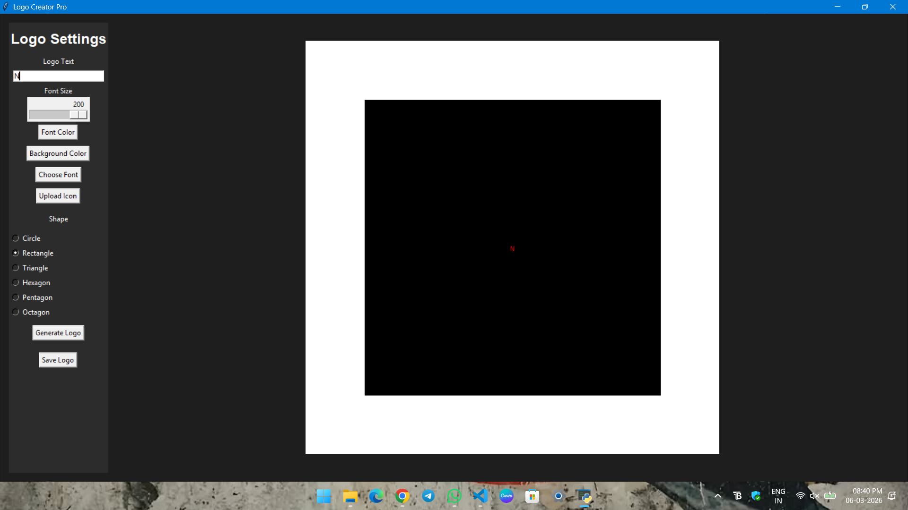

# Design Stamp - Logo Creator Pro 🎨

An interactive Python GUI application built with Tkinter and Pillow to design professional logos with custom shapes, colors, and icons.

## ✨ Features
* **Custom Shapes:** Choose between Circles, Rectangles, Hexagons, and more.
* **Icon Upload:** Overlay your own PNG/JPG icons onto the logo.
* **Live Preview:** Real-time updates as you change text or colors.
* **Pro Exports:** Save your designs as transparent PNG files.

## 🚀 Getting Started
1. Clone the repository:
   `git clone https://github.com/YOUR_USERNAME/design-stamp-logo-generator.git`
2. Install dependencies:
   `pip install -r requirements.txt`
3. Run the application:
   `python main.py`

## 📸 Preview

